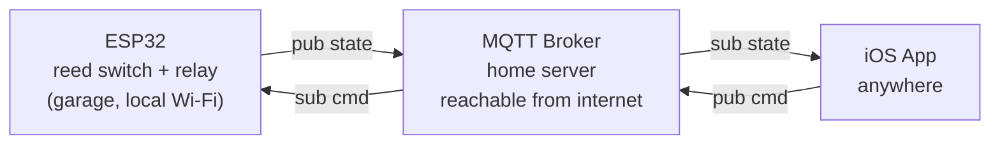

# Architecture v0 — MQTT direct (superseded)

> **Status: superseded by [v1](v1-python-api-bridge.md).** Kept for history — the app never spoke MQTT
> directly to the internet in any shipped build. See v1 for the current design and the reasoning that
> replaced this one.

## Overview

The original draft had the iOS app speak MQTT directly to a broker on the home server, with that broker
reachable from the internet.

## Why this was replaced

Exposing the MQTT broker itself to the internet means opening a broker port, managing broker-level
TLS and per-client auth, and putting MQTT credentials on the phone. The captain preferred not to open
that port at all — see [v1](v1-python-api-bridge.md) for the design that keeps MQTT local-only and
exposes a small REST API instead.

## Message contract (as drafted)

| Topic | Direction | Payload | Retained? |
|---|---|---|---|
| `garage/door/state` | ESP32 → app | `{"state":"open\|closed\|unknown","ts":...}` | yes |
| `garage/door/cmd` | app → ESP32 | `{"cmd":"open\|close","id":"uuid"}` | no |
| `garage/door/cmd/ack` | ESP32 → app | `{"id":"uuid","result":"triggered\|error"}` | no |
| `garage/door/lwt` | ESP32 → app (broker-managed) | `{"online":false}` | yes |

## Open risk flagged at the time

A broker exposed to the internet with no auth or encryption would let anyone who found it open the
garage. This risk is what prompted the move to v1.
