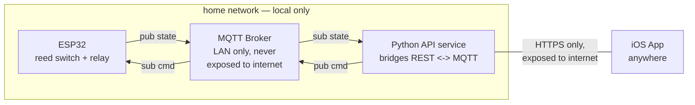

# Architecture v1 — Python API bridge (current)

One environment, no dev/prod split — this is a small personal project. ESP32 hardware and the
home-server MQTT broker are the captain's own; this repo is the iOS app side.

MQTT stays local-only. A small Python service on the home server bridges it to a REST API, so only
that API (not raw MQTT) is ever exposed to the internet.

## Overview

Neither the ESP32 nor the app ever talk to MQTT across the internet. Only the Python service's HTTPS
port is ever exposed — no broker port forwarding, no MQTT credentials anywhere on the phone.

## Local MQTT contract (ESP32 ↔ Python service)

Entirely on the home network — the iOS app never sees these topics directly.

| Topic | Direction | Payload | Retained? | Notes |
|---|---|---|---|---|
| `garage/door/state` | ESP32 → Python service | `{"state":"open\|closed\|unknown","ts":...}` | yes | Retained so the service sees the last known state immediately. |
| `garage/door/cmd` | Python service → ESP32 | `{"cmd":"open\|close","id":"uuid"}` | no | Never retained; `id` matches a later ack. |
| `garage/door/cmd/ack` | ESP32 → Python service | `{"id":"uuid","result":"triggered\|error"}` | no | "triggered" only confirms the relay fired — actual open/close still comes from `state`. |
| `garage/door/lwt` | ESP32 → Python service (broker-managed) | `{"online":false}` | yes | MQTT "last will", published automatically if the ESP32 drops off Wi-Fi. |

## REST API (Python service ↔ iOS app, over the internet)

| Endpoint | Method | Response / body | Notes |
|---|---|---|---|
| `/door/state` | `GET` | `{"state":"open\|closed\|unknown","online":true,"ts":...}` | Served from the service's in-memory value, kept current by staying subscribed locally — no MQTT round-trip per request. |
| `/door/open`, `/door/close` | `POST` | `{"result":"triggered\|error","id":"uuid"}` | Service publishes `cmd` and waits (short timeout) for `cmd/ack` before responding. |
| `/door/events` *(optional, later)* | SSE/WS | stream of state changes | Nice-to-have for a live-updating UI instead of polling; skippable for v1 — polling every few seconds is fine at this scale. |

## Reliability

- **ESP32 reboots / loses Wi-Fi:** broker's last will (`lwt`) flips to offline immediately; on reconnect the ESP32 re-publishes current state as retained, so nothing needs a manual refresh.
- **App sends "open" but nothing happens:** the service waits for `cmd/ack` to confirm the relay fired, then separately watches `state` to confirm the door actually moved — two distinct failures get two distinct messages.
- **App reopens after being backgrounded:** treat state older than a TTL (e.g. 2 min) as `unknown` in the UI rather than trusting a possibly-stale value, until a fresh message arrives (same pattern as gps-location's presence TTL).
- **Broker or Python service restarts:** both auto-reconnect with backoff; the Python service resubscribes and gets the retained state immediately on reconnect.
- **App can't reach the Python service:** a distinct failure mode from "door state unknown" — home server or internet being down should show as "can't reach server," not conflated with door state.

## Security

Keeping MQTT local-only removes the biggest risk from v0 — no broker port, no broker credentials, and
no MQTT protocol surface exposed to the internet at all. The remaining surface is the one REST API.

- **Transport:** HTTPS only for the API — a real cert (Let's Encrypt is standard for a home server with a domain/dynamic DNS name).
- **API auth:** still needed — an unauthenticated HTTPS endpoint that opens a garage is just as risky as an unauthenticated MQTT broker. Simplest workable option: a single long-lived API token/pre-shared key sent as a header, stored in iOS Keychain. Upgrade later to per-device tokens if more users are ever added.
- **Rate limiting:** the Python service should throttle repeated open/close attempts so a leaked token or a bug can't hammer the relay.
- **MQTT credentials:** only the Python service holds them, on the same machine as the broker — the phone never sees an MQTT credential.
- **App-side storage:** the API token goes in iOS Keychain, never `UserDefaults` or hardcoded in the app bundle (this repo is public).

## iOS app — first-pass shape

- **One screen:** a big door-state indicator (open / closed / unknown / unreachable) plus one button that reads "Open" or "Close" depending on current state.
- **Networking:** plain `URLSession` — no MQTT library needed on the iOS side, since the app only ever speaks HTTPS to the Python service.
- **State:** a single small observable object holding connection status + door state + last-updated time, polling `/door/state` every few seconds while foregrounded.

## Python service — first-pass shape

- **Framework:** a small FastAPI (or Flask) app is plenty for four endpoints.
- **MQTT client:** `paho-mqtt` connecting to the local broker, staying subscribed in the background so the API can answer `GET /door/state` instantly from memory.
- **Where it lives:** this is home-server code, not iOS app code — it likely belongs in its own small repo or directory on the server, separate from this iOS-app repo, unless the captain prefers keeping both together given the project's small size.

## Open questions

1. Which MQTT broker software is already running on the home server (Mosquitto is the common free choice)? It only needs to listen on the LAN now, not be reachable from outside.
2. Does the home server already have a way to be reached from the internet for the Python service's HTTPS port (port forwarding, dynamic DNS / a domain name, or a tunnel service like Cloudflare Tunnel/Tailscale)?
3. What should run the Python service — same box as the broker, a Docker container, a systemd service, or something else already used for other home-server projects?
4. Just one door, or should the API/app design leave room for more than one?
5. Just the captain using the app, or should it support multiple users/devices from day one?
