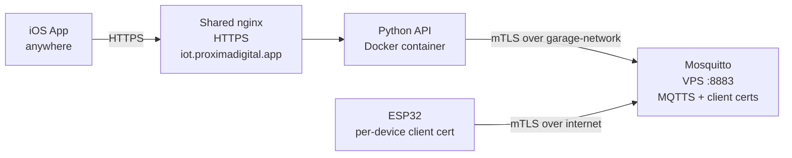

# Architecture v1 — Python API bridge with VPS MQTT mutual TLS (current)

This is the current server-side deployment. The MQTT broker and Python API run on the VPS. The
ESP32 connects to the broker over directly exposed MQTTS port `8883`, while the iOS app continues
to use HTTPS to the API at `iot.proximadigital.app`.

The broker deliberately does not go through nginx: nginx handles HTTP, and Mosquitto terminates
MQTT TLS itself. Every MQTT client has its own certificate signed by this project's private CA.
There is no MQTT password file and no shared MQTT password.

## Overview

```mermaid
flowchart LR
    App["iOS App\nanywhere"]
    Nginx["Shared nginx\nHTTPS\niot.proximadigital.app"]
    API["Python API\nDocker container"]
    Broker["Mosquitto\nVPS :8883\nMQTTS + client certs"]
    ESP32["ESP32\nper-device client cert"]

    App -- "HTTPS" --> Nginx
    Nginx --> API
    API -- "mTLS over garage-network" --> Broker
    ESP32 -- "mTLS over internet" --> Broker
```

The VPS firewall and provider security group must allow TCP `8883` to the broker. The shared nginx
container joins `garage-network` so it can proxy HTTP to `garage-door-api:8000`; MQTT never passes
through nginx.

## Private CA and client identities

`deploy/setup.sh` creates the CA once and is safe to re-run. On the VPS, the state directory defaults
to `$HOME/mqtt` (set `MQTT_DIR` to choose another absolute path):

| Artifact | Host path | Use |
|---|---|---|
| CA private key | `$MQTT_DIR/certs/ca/ca.key` | Signing only; mode `0600`, owned by `root:root`, never copied off the VPS. |
| CA certificate | `$MQTT_DIR/certs/ca/ca.crt` | Trust anchor copied to MQTT clients. |
| Broker key/certificate | `$MQTT_DIR/certs/broker/server.{key,crt}` | Mosquitto's server-side TLS identity. |
| Device identity | `$MQTT_DIR/certs/devices/<device-id>/client.{key,crt}` | One client key/certificate pair per ESP32 or service. |

Run `deploy/issue-device-cert.sh <device-id>` as root for each future device. It is idempotent for
an existing device ID and refuses to overwrite a partial identity. The `garage-api` identity is
created by `setup.sh`; the API is therefore a normal certificate-holding MQTT client.

The issuer prints the three files to copy to the device: `ca.crt`, that device's `client.crt`, and
that device's `client.key`, plus the broker endpoint and identity. The CA private key is never part
of that output and must remain on the VPS.

## MQTT contract

The topic contract is unchanged; only transport and authentication moved to the VPS:

| Topic | Direction | Payload | Retained? | Notes |
|---|---|---|---|---|
| `garage/door/state` | ESP32 → Python service | `{"state":"open\|closed\|unknown","ts":...}` | yes | Retained so the service sees the last known state immediately. |
| `garage/door/cmd` | Python service → ESP32 | `{"cmd":"open\|close","id":"uuid"}` | no | Never retained; `id` matches a later ack. |
| `garage/door/cmd/ack` | ESP32 → Python service | `{"id":"uuid","result":"triggered\|error"}` | no | `triggered` confirms the relay fired; actual state still comes from `state`. |
| `garage/door/lwt` | ESP32 → Python service (broker-managed) | `{"online":false}` | yes | MQTT last will, published when the ESP32 drops off Wi-Fi. |

## Mosquitto security

The checked-in broker configuration listens only on MQTTS port `8883` and requires:

- `cafile` pointing at the private CA certificate;
- `certfile` and `keyfile` pointing at the broker certificate and key;
- `require_certificate true`, so clients without a certificate are rejected;
- `use_identity_as_username true`, so the certificate identity is the MQTT username;
- no `password_file`, `MQTT_USERNAME`, or `MQTT_PASSWORD` authentication path.

The API uses the CA certificate plus the `garage-api` client certificate and key. It does not enable
insecure TLS or username/password fallback. The local integration test exercises all three important
cases: no client certificate fails, a certificate signed by this CA succeeds, and a self-signed
client certificate fails.

## REST API (Python service ↔ iOS app)

| Endpoint | Method | Response / body | Notes |
|---|---|---|---|
| `/door/state` | `GET` | `{"state":"open\|closed\|unknown","online":true,"ts":...}` | Served from the service's in-memory value. |
| `/door/open`, `/door/close` | `POST` | `{"result":"triggered\|error","id":"uuid"}` | Service publishes `cmd` and waits briefly for `cmd/ack`. |
| `/door/events` *(optional, later)* | SSE/WS | stream of state changes | Nice-to-have; polling remains sufficient for v1. |

HTTP is terminated by the shared VPS nginx site in `deploy/nginx/garage-api.conf`, using the existing
`*.proximadigital.app` origin certificate and proxying to `garage-door-api:8000` over
`garage-network`. The retired `garage-api.licongchen.org` site is not part of this deployment.

## Reliability

- **ESP32 reboots / loses Wi-Fi:** the broker's last will flips to offline; on reconnect the ESP32
  republishes current state as retained.
- **App sends a command but nothing happens:** the service waits for `cmd/ack`, then separately
  watches `state` to distinguish relay acknowledgement from door movement.
- **Broker or API restarts:** both reconnect with backoff; the service resubscribes and receives the
  retained state after reconnect.
- **Certificate replacement:** issue a new device identity with a new device ID, flash it later,
  then retire the old device identity through the operational certificate inventory. The CA is not
  copied to devices.

## Operational boundaries

- This repository change prepares the VPS deployment; it does not deploy to the VPS.
- The home-server deployment remains running for the captain's deliberate cutover and is not changed
  by this architecture.
- ESP32 firmware and hardware flashing are a later task. This repository does not generate or embed
  a certificate into `esp32/`.
